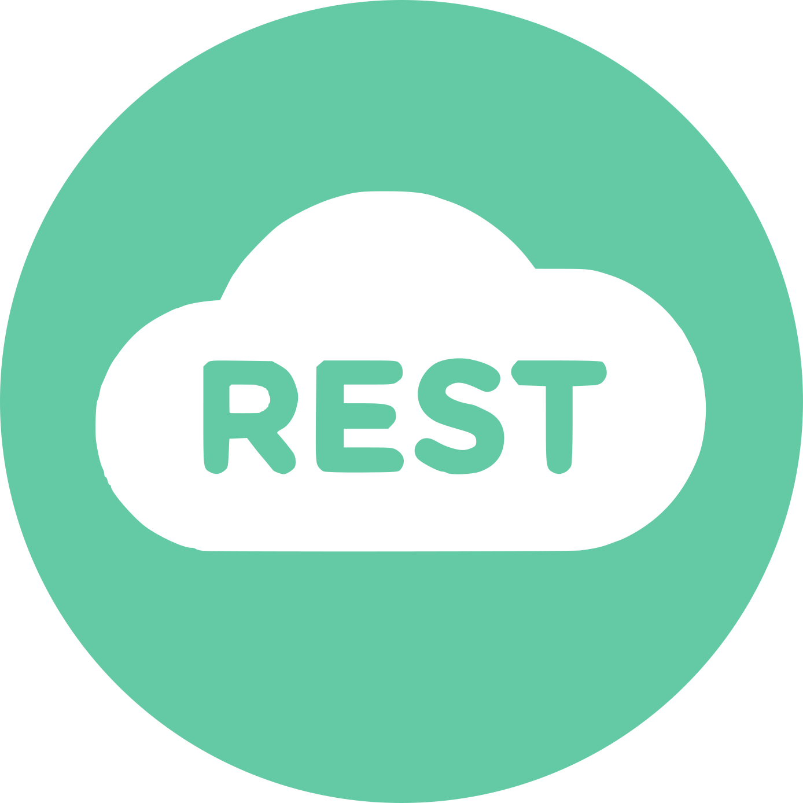

<a id="readme-top"></a>
<div align="center">
  <a href="https://github.com/othneildrew/Best-README-Template">
    
  </a>

  <h1 align="center">RESTful client app</h1>
</div>

## Table of contents
___

1. [About project](#about-project)
    - [Description](#description)
    - [Application structure](#application-structure)
    - [Key benefits](#-key-benefits)
    - [Technologies Used](#technologies-used)
    - [Project architecture](#project-architecture)
2. [Usage](#usage)
    - [Setup Instructions](#setup-instructions)
    - [Scripts in project](#scripts-in-project)
3. [The following people were involved in the project](#the-following-people-were-involved-in-the-project)


## About Project

---

### Description

This is the final project for the React course at Rsschool, a programming school. The aim of the project is to create a lightweight version of Postman within a single app.

### Application structure

1. Main page
2. User registration/authentication.
3. RESTful client, which includes:
   - method selector
   - text input for the endpoint URL
   - request editor
   - headers editor
   - response section
   - generated code section
4. Variables
5. History

### 🔥 Key Benefits

- 🧭 **Intuitive and friendly UI**
- ⚡ **Fast loading and responsive design**
- 🛠️ **Modern tech stack (SSR)**
- 🛍️ **Added a lot feature, like a variables**

### Technologies Used

- Frontend

  <a href="https://nextjs.org/">
     Nextjs
  </a>

  <a href="https://www.typescriptlang.org/">
     Typescript
  </a>

  - 🎨 Scss
  - ✅ Zod

- Backend


- Utility: Linter & Testing
  - ❗ ESlint
  - 🧹 Lint-staged
  - 🪄 Prettier
  - 🐶 Husky
  - 🧪 Vitest


### Project architecture

- styles - styles files (global, mixins, variables)
- components - React components for creating pages
- app - Next js app routing
- interfaces - interfaces for Project
- constants - reusable constants
- test - for testing files
- hooks - custom hooks
- providers - include components with all context providers
- services - include all services for interaction with the backend and other remote applications
- store - all zustand stores
- theme - material UI theme
- utils - helping utilities

<p align="right">(<a href="#readme-top">back to top</a>)</p>


## Usage

---

### Setup Instructions

1. Install Node.js (Node version >= v22.13.1)

  ```sh
  npm install npm@latest -g
  ```

2. Obtain the Project Files: you have two options for obtaining the project files:

- Fork the Repository: If you plan to contribute to the project or make changes to the code, it's recommended to fork the repository. This will create a copy of the repository under your GitHub account. [Fork the repository](https://github.com/etcq/rest-client-app/fork) to create a copy under your account.

- Download the Repository: If you only intend to use the project locally and don't plan to contribute changes, you can simply download the repository as a ZIP file. [Download the repository](https://github.com/etcq/rest-client-app/archive/refs/heads/main.zip) as a ZIP file and extract it to your local machine.

3. Clone the Repository (if Forked): if you forked the repository, clone your newly created repo to your local machine using the following command:

```
git clone https://github.com/YOUR-USERNAME/rest-client-app.git
```

4. Navigate to the Project Directory: once you have obtained the project files (either by forking or downloading), navigate to the project directory:

```
cd rest-client-app
```

5. To install all dependencies use:

```
npm install
```

Create a .env file in the root directory of the project: refer to the .env.example file as a reference or template for configuring .env file and add the environment variables with your own values.

6. Run development version: 

```
npm run dev
```

7. Build the Project:

to build the project, use the following command:

```
npm run build
```

8. Preview the Project: to preview the project, use the following command:

```
npm run preview
```
<p align="right">(<a href="#readme-top">back to top</a>)</p>

### Scripts in project

1. `npm run dev` - to run develop mode
2. `npm run build` - to build project in `dist` folder
3. `npm run start` - to preview project
4. `prepare` - init husky in project
5. `lint` - to lint typescript and react components files with ESlint
8. `format:fix` - to fix linting issues TS and SCSS file with prettier and stylelint
9. `test` - to run vitest testing mode
10. `coverage` - to run vitest coverage


<p align="right">(<a href="#readme-top">back to top</a>)</p>


## The following people were involved in the project

---

### Authors

- [aQafresca](https://github.com/aQafresca)
- [turik777](https://github.com/turik777)
- [etcq](https://github.com/etcq)

### Mentors

- [aleksey-drozdov](https://github.com/aleksey-drozdov)
- [micolka](https://github.com/micolka)

<p align="right">(<a href="#readme-top">back to top</a>)</p>